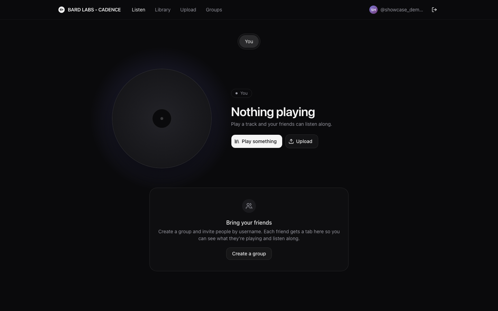
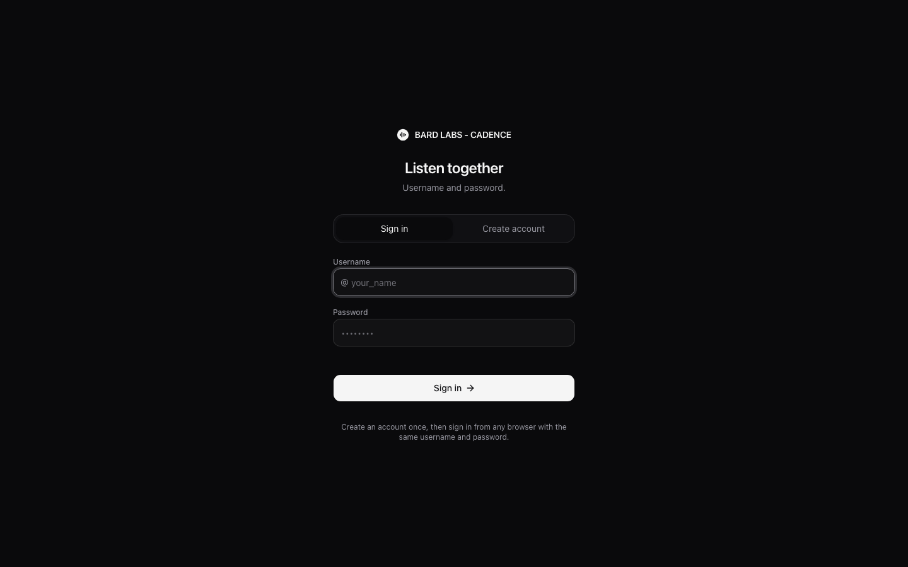
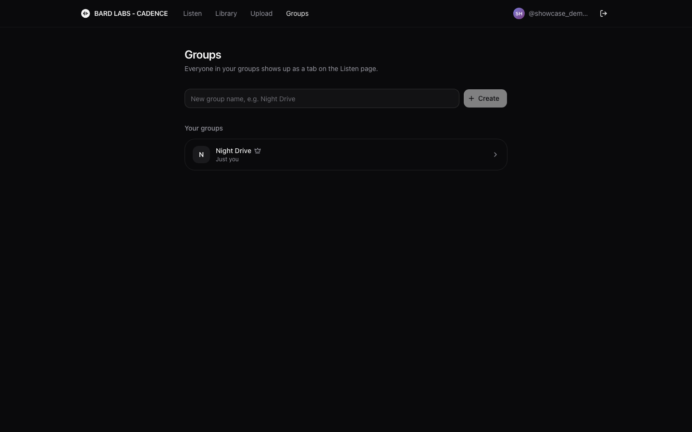
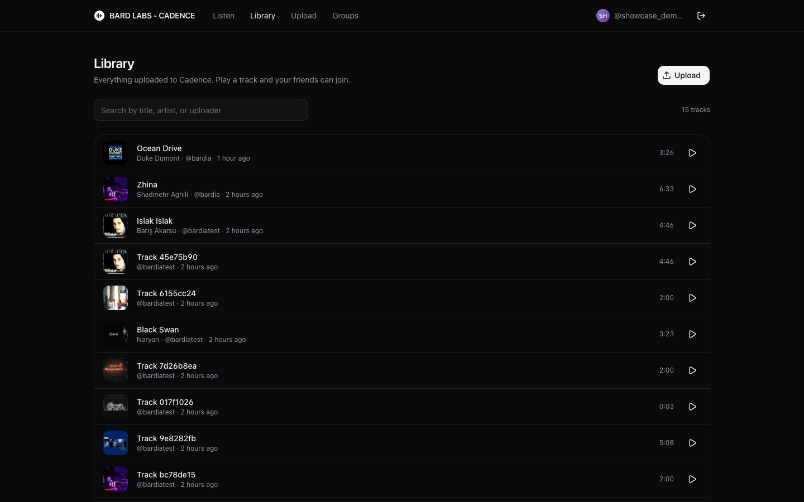
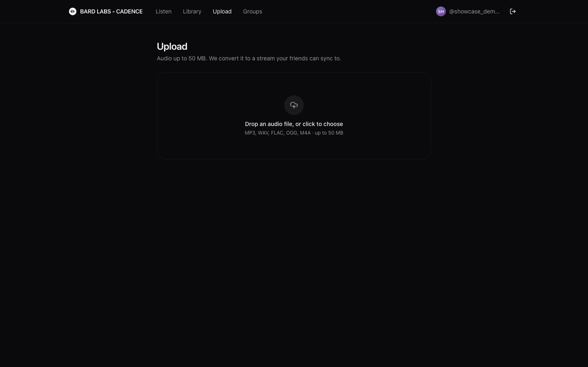
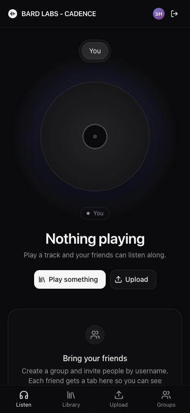

# Cadence

**Listen along with friends, in sync.** Upload music, form groups, and see what everyone is playing. Click someone's tab and your player follows theirs — typically within a few tens of milliseconds.

<p align="center">
  
</p>

| | |
| --- | --- |
|  |  |
|  |  |

<p align="center">
  
</p>

## Why this project

Cadence is a full-stack realtime music product: not a toy chat demo and not a thin wrapper around a vendor SDK. It covers the hard parts end to end — auth, object storage, background transcoding, multi-instance fan-out, clock sync, and a player that stays locked to a remote host.

Interview talking points live in the code:

- **Sub-100ms listen-along** using WebSockets, Redis pub/sub, and a client audio engine that corrects drift every second
- **Horizontally scalable API** — room state in Redis, Postgres for durable data, workers claiming jobs with `FOR UPDATE SKIP LOCKED`
- **Production-shaped security** — httpOnly sessions, CSRF defenses, origin checks, rate limits, CSP, and private originals with public HLS
- **Real media pipeline** — browser → presigned S3 upload → ffmpeg HLS → hls.js playback

## Stack

| Layer | Tech |
| --- | --- |
| Web | Next.js 16, React 19, Tailwind v4, TanStack Query, Zustand, hls.js, Framer Motion |
| API | Go, chi, pgx, Redis, MinIO (S3), coder/websocket, Prometheus metrics |
| Worker | Go + ffprobe/ffmpeg → AAC HLS (6s segments) |
| Shared | TypeScript protocol package mirrored in Go |
| Infra | Docker Compose, Caddy, optional Cloudflare DDNS for home hosting |

## Architecture

```
 Browser (Next.js)
   │  REST  (cookie: cadence_session)        ┌──────────────┐
   ├────────────────────────────────────────►│              │──► Postgres   users, sessions, groups,
   │  WebSocket /ws  (same cookie)            │   Go API     │               invites, tracks, jobs
   ├────────────────────────────────────────►│  (cmd/api)   │──► Redis      room state, presence,
   │                                          │              │               pub/sub fan-out
   │  presigned POST (upload original)        └──────────────┘
   ├──────────────────────────► MinIO / S3 ◄──── Worker (cmd/worker)
   │  GET hls/*.m3u8 + .ts                        claims jobs → HLS
   └──────────────────────────►
```

**Listen-along in four steps**

1. Host plays a track; the client streams `state` messages (position, pause, rate, capture time).
2. The API stores them in Redis and publishes on `cadence:events`.
3. A friend clicks **Listen along**; the API checks a shared group and returns a room snapshot.
4. The listener loads the same HLS URL and seeks to `position + (serverNow − capturedAt) × rate`, then corrects drift continuously.

Deeper write-ups: [`docs/architecture.md`](docs/architecture.md) and [`docs/guide/04-realtime-sync.md`](docs/guide/04-realtime-sync.md).

## Quickstart

**Need:** Docker Desktop (running), Go 1.26+, Node 22+, pnpm 11, ffmpeg (`brew install ffmpeg`).

```bash
make env
pnpm install
cp apps/web/.env.local.example apps/web/.env.local
make dev
```

Open [http://localhost:3000](http://localhost:3000). `make dev` starts Postgres, Redis, and MinIO, then runs the API (`:8080`), worker, and web app together. Ctrl+C stops the processes.

### Try listen-along solo

Use two browser profiles (or one normal + one private window).

1. **Window A** — create an account (e.g. `alice` / a password ≥ 8 chars). Create a group and invite `bob` (Bob must register first).
2. **Window B** — sign in as `bob`, open Groups, accept the invite.
3. **Window A** — upload a track, play it from Library.
4. **Window B** — on Listen, open the `alice` tab → **Listen along**.

Prefer separate terminals?

```bash
make up
make dev-api      # terminal 1
make dev-worker   # terminal 2
make dev-web      # terminal 3
```

> Paste commands without trailing `#` comments — zsh treats them as arguments.

## Scripts

| Command | What it does |
| --- | --- |
| `make dev` | Infra + API + worker + web |
| `make up` / `make down` | Start or stop Postgres, Redis, MinIO |
| `make test` | `go vet` + tests, Biome, ESLint, production web build |
| `make dev-api-docker` | API in Docker (if the local Go linker fails on macOS) |
| `pnpm check` | Biome lint + format check for the monorepo |

## Repo layout

```
apps/web/                 Next.js app
  src/proxy.ts            login gate (no session cookie → /login)
  src/app/(auth)/login    sign-in / register
  src/app/(app)/          Listen, Library, Upload, Groups
  src/features/player/    audio engine (host + listener sync) and player bar
  src/features/listen/    people tabs, vinyl artwork
  src/lib/realtime/       WebSocket client, clock sync, room store
packages/protocol/        shared WS message types
services/core/
  cmd/api, cmd/worker     entrypoints
  db/migrations           SQL embedded in the binary
  internal/httpapi        REST, middleware, error model
  internal/realtime       WebSocket hub, presence, rooms
  internal/store          Postgres queries
  internal/storage        S3/MinIO (presigned uploads, HLS)
  internal/worker         ffprobe/ffmpeg transcoder
deploy/                   compose (dev + prod), Caddy, k6, DDNS helpers
docs/                     architecture, ADRs, learning guide, screenshots
```

## CI

GitHub Actions on every push and PR to `main`:

- **ci-core** — `go vet`, `go test`, `go build` for API and worker
- **ci-web** — pnpm (from `packageManager`), Biome, ESLint, production Next.js build

Locally, `make test` mirrors that gate.

## Production

Home-server / VPS deploy notes live in [`deploy/DEPLOY.md`](deploy/DEPLOY.md): Docker Compose prod stack, Caddy reverse proxy, MinIO, optional Cloudflare DDNS. Prometheus `/metrics` stays on the API container (not exposed through Caddy).

## Learn the system

Start with [`docs/architecture.md`](docs/architecture.md), then the guide in order:

1. [`docs/guide/00-setup.md`](docs/guide/00-setup.md) — run & troubleshoot
2. [`docs/guide/01-go-backend-basics.md`](docs/guide/01-go-backend-basics.md)
3. [`docs/guide/02-auth-and-groups.md`](docs/guide/02-auth-and-groups.md)
4. [`docs/guide/03-uploads-and-hls.md`](docs/guide/03-uploads-and-hls.md)
5. [`docs/guide/04-realtime-sync.md`](docs/guide/04-realtime-sync.md) — the core of listen-along
6. [`docs/guide/05-frontend.md`](docs/guide/05-frontend.md)
7. [`docs/guide/06-observability-and-load-testing.md`](docs/guide/06-observability-and-load-testing.md)
8. [`docs/guide/07-iot-roadmap.md`](docs/guide/07-iot-roadmap.md)
9. [`docs/guide/08-security.md`](docs/guide/08-security.md)
10. [`docs/guide/09-testing.md`](docs/guide/09-testing.md)

Design decisions and trade-offs: [`docs/adr/`](docs/adr/).

## License

Private / portfolio project unless otherwise noted.
